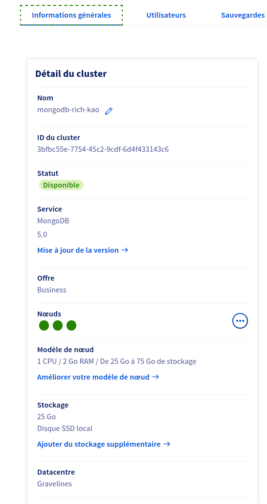
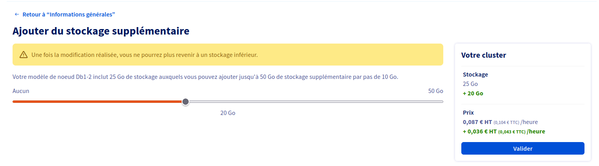

**Last updated December 14th 2022**

## Objective

This guide aims to explain how to adjust the storage space of your cluster according to your needs

> [!primary]
>
> This feature is available for engines that use storage space
>

## Requirements

- Access to the [OVHcloud Control Panel](https://www.ovh.com/auth/?action=gotomanager&from=https://www.ovh.co.uk/&ovhSubsidiary=GB)
- A [Public Cloud project](https://www.ovhcloud.com/en-gb/public-cloud/) in your OVHcloud account.

## Instructions

To adjust the storage space of your cluster, you must first log in to your OVHcloud control panel and open your public cloud project. Click on Databases in the left navigation bar, select your engine instance and then the General Information tab.

Then click on `Add additional storage`{.action} and adjust the storage space of your cluster

## We want your feedback!

We would love to help answer questions and appreciate any feedback you may have.

Are you on Discord? Connect to our channel at <https://discord.gg/PwPqWUpN8G> and interact directly with the team that builds our databases service!
